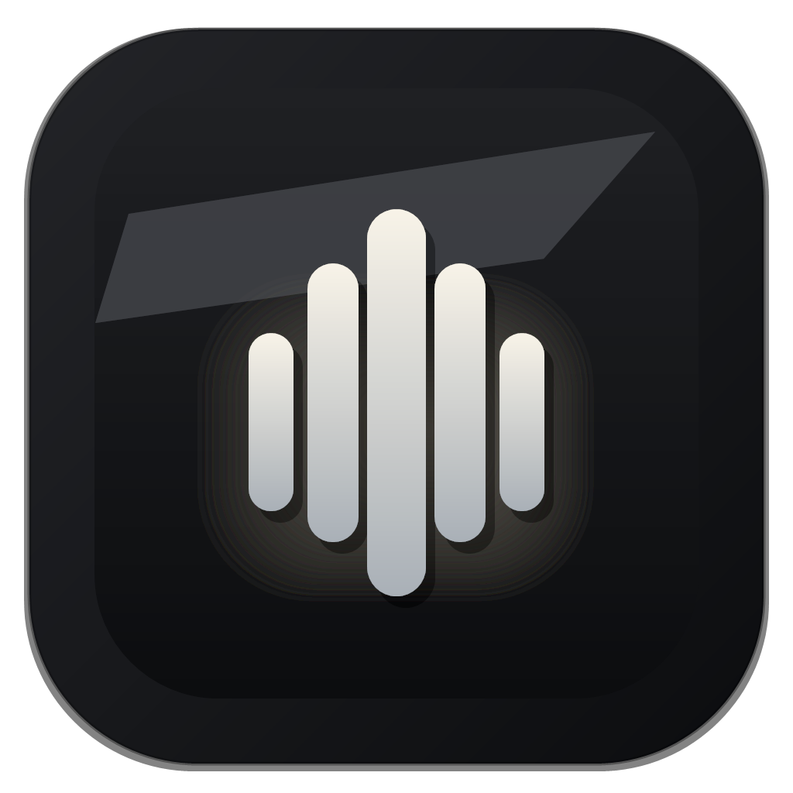

<p align="center">
  
</p>

<h1 align="center">Speak</h1>

<p align="center">
  <strong>A powerful Windows dictation &amp; text-to-speech application powered by local AI</strong>
</p>

<p align="center">
  <a href="https://github.com/hamza/speak/actions/workflows/build.yml">
    
  </a>
  
  
  
</p>

---

## ✨ Features

| Feature | Description |
|---|---|
| 🎙️ **Dictation** | Press a global hotkey (`Ctrl+Win` by default) to start voice input anywhere |
| 🧠 **Local Whisper STT** | Transcribe speech locally using OpenAI Whisper (large-v3, GPU-accelerated) |
| ☁️ **Cloud STT** | Optionally use Groq's Whisper API for fast cloud transcription |
| 🔊 **AI Text-to-Speech** | Synthesize speech with Qwen3-TTS (1.7B), Tortoise TTS, or Chatterbox |
| 🎭 **Custom Voices** | Create and use custom voice profiles |
| ✏️ **LLM Polish** | Optionally post-process transcripts with a local or remote LLM |
| 📚 **Auto-Learning** | Learns from your corrections over time for personalized accuracy |
| 📋 **History** | Browse, copy, and manage your dictation history |
| 🔗 **REST API** | Built-in local REST API for integration with other apps |
| 🌙 **System Tray** | Runs quietly in the system tray; minimizes out of your way |
| 🌗 **Dark / Light Theme** | Full dark and light mode support |

---

## 🖼️ Screenshots

> *(Screenshots coming soon)*

---

## 📋 Requirements

- **OS**: Windows 10/11 (64-bit)
- **Runtime**: .NET 8 (included in self-contained builds)
- **GPU** *(optional but recommended)*: NVIDIA GPU with CUDA for local Whisper and Qwen3-TTS
- **For local Whisper**: Python 3.10+ with a CUDA-enabled environment
- **For Qwen3-TTS**: Python 3.11 environment (`.qwen-tts-env/`)
- **For Cloud STT**: A [Groq API key](https://console.groq.com) (free tier available)

---

## 🚀 Getting Started

### Option 1 — Download the Installer *(recommended)*

Download the latest release from the [Releases](../../releases) page:

- **`Speak-x.x.x-Complete-Setup.exe`** — includes Speak, .NET runtime, Python runtime, Whisper, Qwen TTS, and FFmpeg
- **`Speak-x.x.x-Offline-Models.zip`** *(optional)* — offline weights for Whisper large-v3 and Qwen3 models

Run the setup `.exe` and follow the wizard. If you downloaded the offline model pack, extract it **before** running setup.

### Option 2 — Build from Source

```powershell
# 1. Clone the repository
git clone https://github.com/your-username/speak.git
cd speak

# 2. Copy and configure settings
copy appsettings.template.json appsettings.json
# Edit appsettings.json with your model/tool paths

# 3. Build
dotnet build Speak.csproj -c Release

# 4. Run
dotnet run --project Speak.csproj
```

---

## ⚙️ Configuration

Copy `appsettings.template.json` to `appsettings.json` and fill in the paths for your machine:

```jsonc
{
  "Paths": {
    "ToolsRoot": "C:\\path\\to\\Speak",      // Where Speak tools live
    "ModelsRoot": "C:\\path\\to\\Models",    // Where AI model weights live
    "CacheRoot": ""                           // Leave empty for default (%LocalAppData%\Speak\cache)
  },
  "Transcription": {
    "DefaultEngine": "whisper-local",         // or "cloud"
    "DefaultDevice": "cuda",                  // or "cpu"
    "WhisperPythonPath": "C:\\path\\to\\whisper-gpu-env\\Scripts\\python.exe",
    "WhisperModelPath": "C:\\path\\to\\Models\\whisper\\large-v3.pt"
  },
  "TTS": {
    "DefaultEngine": "qwen3-customvoice-1.7b",
    "ComfyUIPythonPath": "C:\\path\\to\\.qwen-tts-env\\Scripts\\python.exe",
    "QwenTtsCustomVoiceModelPath": "C:\\path\\to\\Models\\Qwen3-TTS-12Hz-1.7B-CustomVoice"
  },
  "CloudSTT": {
    "DefaultProvider": "groq",
    "DefaultApiKeyEnvVar": "GROQ_API_KEY"    // Set the GROQ_API_KEY env var on your machine
  }
}
```

> **Note**: `appsettings.json` is in `.gitignore` and will never be committed — your paths stay private.

---

## 🏗️ Project Structure

```
Speak/
├── MaxFlowWindows/          # WPF UI layer (App.cs, MainWindow.cs, etc.)
├── MaxFlowWindows.Core/     # Core business logic (transcription, TTS, config, etc.)
├── speak/                   # VAD model (silero_vad.onnx)
├── tools/                   # Bundled tool scripts
├── packaging/               # InnoSetup installer scripts
├── .github/workflows/       # GitHub Actions CI/CD
├── appsettings.template.json
└── Speak.csproj
```

---

## 🔧 CI / CD

GitHub Actions automatically:
- **Builds** on every push to `main`/`master` and on pull requests
- **Publishes** a self-contained Windows x64 binary as a build artifact
- **Creates a GitHub Release** with a `.zip` whenever you push a `v*` tag (e.g. `v1.0.0`)

To release a new version:
```powershell
git tag v1.0.0
git push origin v1.0.0
```

---

## 🤝 Contributing

Contributions are welcome! Please:

1. Fork the repository
2. Create a feature branch (`git checkout -b feature/my-feature`)
3. Commit your changes (`git commit -m 'Add some feature'`)
4. Push to the branch (`git push origin feature/my-feature`)
5. Open a Pull Request

---

## 📄 License

This project is licensed under the **Apache License 2.0** — see the [LICENSE](LICENSE) file for details.

---

## 🙏 Acknowledgements

- [OpenAI Whisper](https://github.com/openai/whisper) — speech recognition model
- [Qwen3-TTS](https://huggingface.co/Qwen) — text-to-speech model
- [NAudio](https://github.com/naudio/NAudio) — Windows audio library
- [Silero VAD](https://github.com/snakers4/silero-vad) — voice activity detection
