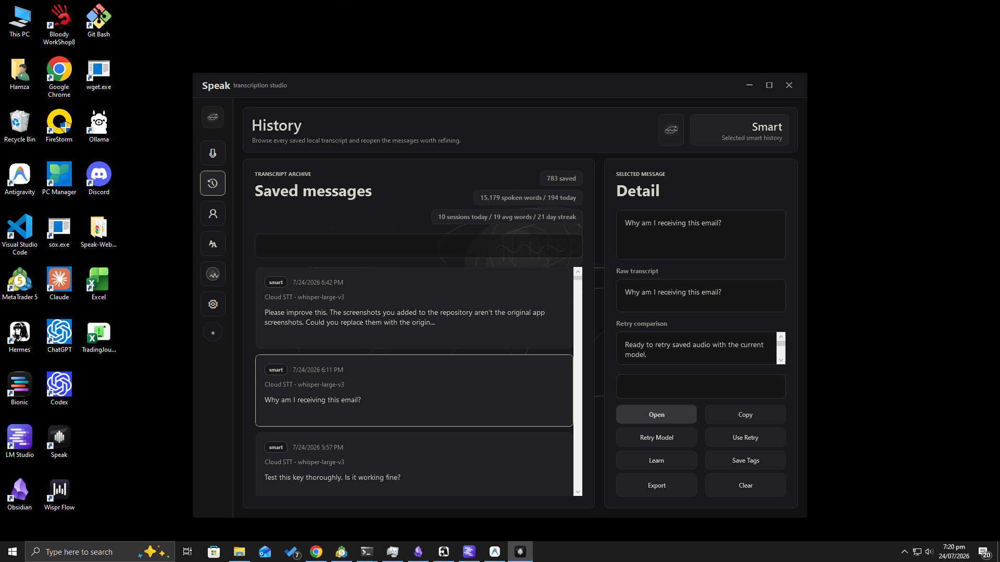
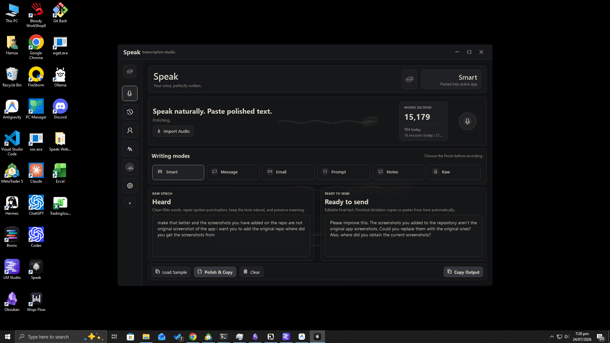
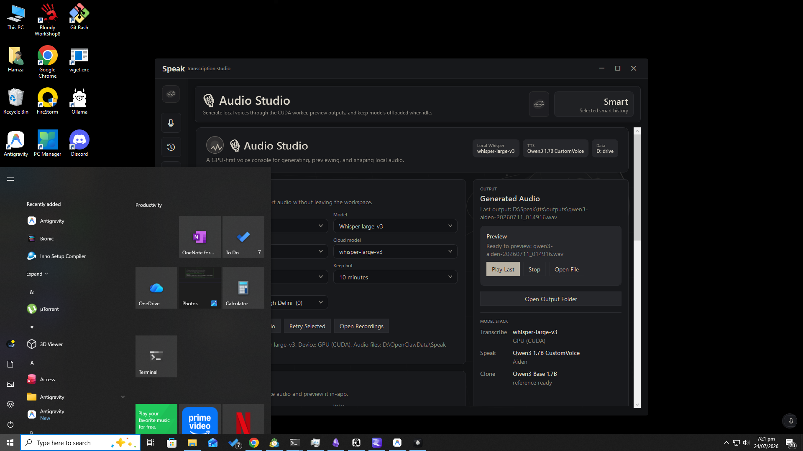
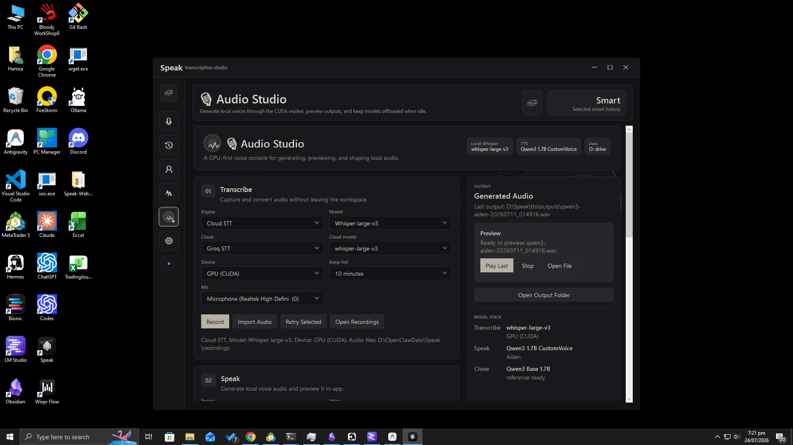
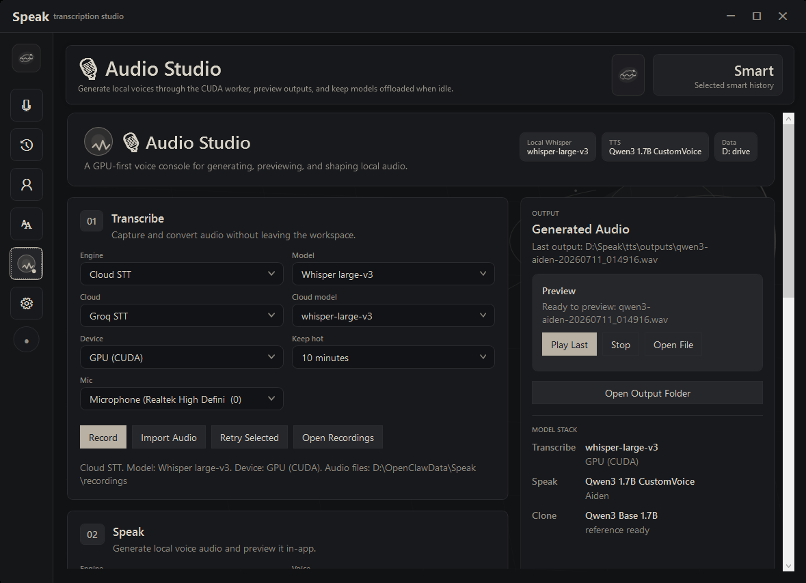

<p align="center">
  
</p>

<h1 align="center">Speak</h1>

<p align="center">
  Private, local-first voice writing for Windows. Talk naturally and get polished text in any application.
</p>

<p align="center">
  <a href="https://github.com/absentmindz/Speak/actions/workflows/build.yml">
    
  </a>
  
  
  
</p>

## Download and run

1. Go to the **[Releases page](https://github.com/absentmindz/Speak/releases)**.
2. For v0.5.2 or later, download `Speak-<version>-Setup.exe` under **Assets**.
3. Verify it against the matching entry in `SHA256SUMS.txt`.
4. Run the installer (administrator approval is required).

The installer is self-contained, so running Speak does not require the .NET
SDK. Groq cloud transcription does not require local Python, but it does
require an API key. Local Whisper and TTS are not bundled: they require
separate Python environments, dependencies, and model downloads.

> Speak is currently a pre-release source project. Review the security and
> privacy notes before using it with sensitive audio or text.

## What it does

- Global-hotkey dictation into Windows applications.
- Local Whisper transcription when a compatible Python environment and model
  are configured.
- Optional Groq cloud transcription.
- Local Qwen3, Tortoise, and Chatterbox text-to-speech integrations.
- Optional local or remote LLM transcript polishing.
- Local history, dictionary, correction learning, and voice-profile tools.
- A token-protected loopback REST integration that is disabled by default.

Local engines process audio on the computer. Cloud STT and remote LLM
polishing send audio or text to the configured provider. They are not the same
privacy mode. See [PRIVACY.md](PRIVACY.md) for the exact boundaries.

## Screenshots

<p align="center">
  
</p>

<p align="center">
  
</p>

<p align="center">
  
</p>

<p align="center">
  
</p>

<p align="center">
  
</p>

The repository screenshots contain demonstration data only. Do not attach
screenshots containing real transcripts, usernames, paths, notifications, or
taskbar details to an issue.

## Requirements

- Windows 10 version 1809 or newer, or Windows 11, on x64 hardware.
- The .NET 8 SDK to build from source. Published artifacts are self-contained.
- For local Whisper/TTS: compatible Python environments, model weights, and
  any required CUDA/FFmpeg dependencies.
- For cloud transcription: a provider API key stored in an environment
  variable, never in the repository.

GPU acceleration is optional for the application but strongly recommended for
the larger local models.

## Build from source

```powershell
git clone https://github.com/absentmindz/Speak.git
cd Speak

dotnet restore Speak.sln --locked-mode
dotnet build Speak.sln -c Release --no-restore
dotnet test Speak.sln -c Release --no-build
dotnet run -c Release --project Speak.csproj
```

A clean checkout starts with safe portable defaults; `appsettings.json` is
optional. To configure local runtimes, copy the template:

```powershell
Copy-Item appsettings.template.json appsettings.json
```

The local `appsettings.json` is ignored by Git, copied to development output,
and explicitly excluded from publish artifacts.

## Configuration

Portable tokens can be used instead of machine-specific paths:

| Token | Resolves to |
|---|---|
| `{AppDir}` | the directory containing `Speak.exe` |
| `{LocalAppData}` | the current user's local application-data directory |
| `{CommonAppData}` | the shared Windows application-data directory |
| `{UserProfile}` | the current user's profile directory |
| `{ModelsRoot}` | the validated model root selected by configuration, environment, or installer |

Set `SPEAK_MODELS_ROOT` to override model discovery. Optional
`SPEAK_FFMPEG_BIN` and `SPEAK_SOX_BIN` variables can point to custom binary
directories without embedding machine-specific paths in source or JSON.
Set `SPEAK_DATA_ROOT` to use an isolated data directory. An explicit data-root
override never imports history, recordings, logs, or settings from the normal
local application-data directory; the one-time legacy import runs only for
the default data location. Speak records completion of that import so clearing
history or recordings cannot cause old legacy copies to reappear on restart.
Local worker port conflicts can be resolved with
`SPEAK_WHISPER_SERVER_PORT`, `SPEAK_QWEN_CUSTOMVOICE_WORKER_PORT`, and
`SPEAK_QWEN_BASE_WORKER_PORT`. Their hosts remain fixed to loopback for
security. Cloud API keys are read from the environment variable named by the
configuration (`GROQ_API_KEY` by default); the key value does not belong in
JSON.

Correction auto-learning is off by default because it may inspect text in the
foreground application. Enable it only after reviewing the setting's privacy
impact.

### Local REST integration

The loopback REST API is disabled unless both of these environment variables
are configured:

```text
SPEAK_ENABLE_REST_API=1
SPEAK_REST_API_TOKEN=<a long random secret>
SPEAK_REST_API_PORT=19876
```

`SPEAK_REST_API_PORT` is optional; the default is `19876`.

Treat the token like a password. Do not expose the loopback port through a
proxy, firewall rule, tunnel, or port-forward.

## Packages and releases

For a version tag that exactly matches `Directory.Build.props`, CI publishes
one **self-contained Inno Setup installer** (`Speak-<version>-Setup.exe`), one
**portable ZIP**, one SPDX 2.2 software bill of materials, and
`SHA256SUMS.txt`. The checksum file covers every other release asset exactly
once, and CI verifies the hashes again before creating the GitHub release. Tag
builds also create GitHub-hosted build-provenance attestations for all four
assets after checksum verification. Attestations supplement rather than
replace `SHA256SUMS.txt`. The SBOM is also embedded in the portable ZIP. A
release is not an offline-AI bundle: model weights and Python/CUDA runtimes are
separate.

Maintainers build the machine-wide installer and complete release set through
the canonical
[`packaging/build-packages.ps1`](packaging/build-packages.ps1) path. The app
installer requires administrator approval and preserves Speak 0.5's
machine-wide identity and existing local runtime configuration so an upgrade
replaces the earlier installation without discarding configured paths. The
packaging process never copies the maintainer's virtual environment, settings,
history, recordings, or API keys. Offline model-pack production remains
disabled pending an audited provenance manifest. See
[packaging/README.md](packaging/README.md).

Installers are not currently Authenticode-signed. Verify
`SHA256SUMS.txt` and expect Windows to show an unknown-publisher warning.

## Repository layout

```text
MaxFlowWindows/          WPF application windows and interaction logic
MaxFlowWindows.Core/     configuration, persistence, STT/TTS, and integrations
*.xaml                   editable WPF window layouts
tools/                   reviewed Python worker source
tests/Speak.Tests/       automated .NET tests
packaging/               publish validation and Inno Setup packaging
.github/                 CI, security scanning, and contribution templates
```

## Contributing and security

Read [CONTRIBUTING.md](CONTRIBUTING.md) before opening a pull request. Use
[GitHub's private vulnerability reporting](https://github.com/absentmindz/Speak/security/advisories/new)
for security issues; do not post secrets, private audio, or transcripts in a
public issue. The full policy is in [SECURITY.md](SECURITY.md).

## DI Container

Speak includes a lightweight Dependency Injection container in `MaxFlowWindows.Core.ServiceContainer`. It supports singleton and transient lifetimes, constructor injection, factory registration, and thread-safe resolution.

### Register services

```csharp
var container = new ServiceContainer();
container.Register<ILogger, ConsoleLogger>().AsSingleton();
container.Register<IRepository, SqlRepository>().AsTransient();
```

### Resolve services

```csharp
var logger = container.Resolve<ILogger>();
```

Constructor parameters are resolved automatically:

```csharp
// UserService(IRepository repository, ILogger logger)
var userService = container.Resolve<UserService>();
```

### Register an existing instance

```csharp
container.RegisterInstance<ILogger>(new ConsoleLogger());
```

### Register a factory

```csharp
container.RegisterFactory(() => new LoggingService(), ServiceLifetime.Singleton);
```

### Check registration

```csharp
if (container.IsRegistered<ILogger>()) { ... }
```

### Lifetimes

- **Singleton** — same instance returned on every resolve.
- **Transient** — new instance created on every resolve.

### Duplicate registration

Registering the same service type twice throws `InvalidOperationException`.

## Website and commercial launch

The launch site and pricing draft live in [`docs/index.html`](docs/index.html)
and deploy through GitHub Pages. The complete seven-step commercial foundation
is documented in [`docs/commercial/`](docs/commercial/README.md), including
positioning, preliminary brand risk, checkout/licensing architecture, the
Founding 100 campaign, and Microsoft Store readiness.

Speak Community remains Apache-2.0 licensed. The planned Founding Pro offer is
for official convenience, guided setup, priority support, and separately
developed additions; it does not take existing Community features away. The
$39 founding offer is not available for payment until a merchant account,
refund terms, and server-side entitlement service are configured.

## License

Speak is licensed under the [Apache License 2.0](LICENSE). Attribution
information is in [NOTICE](NOTICE).

## Acknowledgements

- [OpenAI Whisper](https://github.com/openai/whisper)
- [Qwen3-TTS](https://huggingface.co/Qwen)
- [NAudio](https://github.com/naudio/NAudio)
- [Silero VAD](https://github.com/snakers4/silero-vad)
